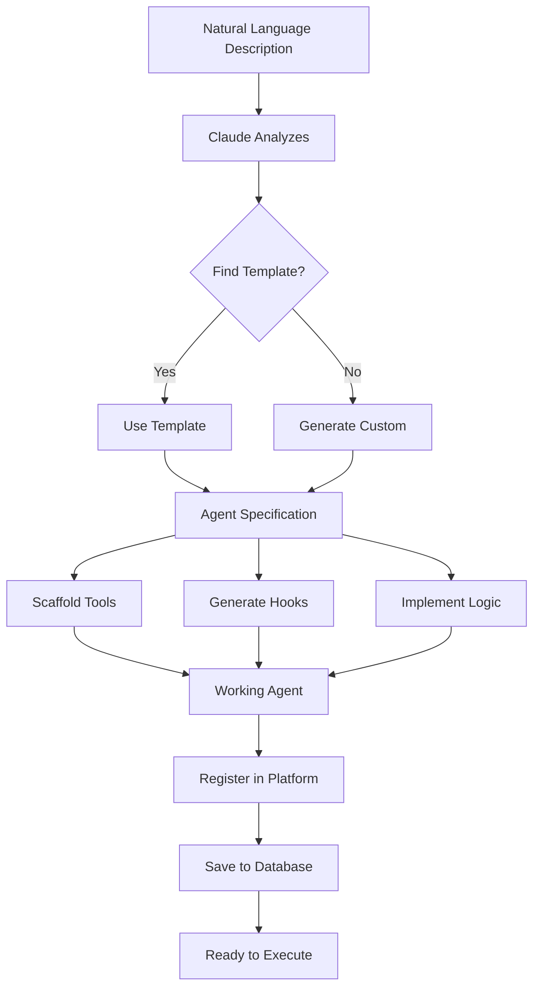

# AI-Native Development Platform

**Build agentic applications using natural language. Tiny teams + AI = more applications.**

---

## 🌟 Vision

This platform embodies the future of software development: **AI-native development platforms** that enable forward-deployed engineers embedded in business units to rapidly build applications by collaborating with domain experts—using nothing more than natural language descriptions.

### Key Principles

1. **Natural Language First**: Describe what you want, get a working agent
2. **Forward-Deployed Engineers**: Engineers embedded in business units
3. **Domain Expert Collaboration**: Build together, not in silos
4. **Tiny Teams + AI**: 1-2 people + AI can build what used to require 5-10 people
5. **Rapid Iteration**: Create, test, iterate in minutes, not weeks

---

## 🚀 Quick Start

### Interactive Mode (Recommended)

```bash
npm run platform
```

Then simply describe what you need:

```
🤔 What would you like to build?
> Build an agent that validates customer email addresses and phone numbers,
  flags invalid entries for review, and enriches valid entries with
  geolocation data from an external API
```

The platform will:
1. ✅ Generate a complete agent specification
2. ✅ Scaffold working code with all tools
3. ✅ Create pre/post hooks for audit trails
4. ✅ Save to your project
5. ✅ Ready to run immediately

### Quick Create Mode

```bash
npm run platform create "Validate customer emails"
```

### Collaboration Mode

```bash
npm run platform collaborate "Sarah Johnson" "Sales Operations"
```

Interactive session to gather requirements from domain experts.

---

## 📚 Core Concepts

### 1. Forward-Deployed Engineers

**Definition**: Software engineers embedded in business units, working directly with domain experts.

**Traditional Model**:
```
Business Unit → IT Department → Dev Team → Code → Deploy
(Weeks/months of delay, lost context)
```

**AI-Native Model**:
```
Business Unit + Forward-Deployed Engineer + AI Platform → Working Application
(Minutes/hours, direct collaboration, immediate feedback)
```

**Example**:
- Sarah works in Sales Operations
- John (engineer) sits with Sarah's team
- Sarah: "We need to validate all customer emails in our database"
- John: `npm run platform collaborate "Sarah" "Sales"`
- Platform guides them through requirements
- Working agent deployed in < 30 minutes

### 2. AI-Powered Agent Generation

The platform uses Claude to convert natural language descriptions into complete, working agents.

**You describe** (natural language):
```
"Build an agent that processes invoices, extracts line items,
validates totals, and flags discrepancies for review"
```

**Platform generates** (working code):
```javascript
- Agent specification
- Tool implementations
  - extract_line_items
  - validate_totals
  - flag_discrepancies
- Pre/post hooks for audit
- Error handling
- Metrics tracking
```

### 3. Agent Templates

Pre-built templates for common patterns:

| Template | Use Case | Tools |
|----------|----------|-------|
| **data-validator** | Validate incoming data | validate, store |
| **data-enricher** | Enrich data with external sources | enrich, fetch, store |
| **workflow-orchestrator** | Multi-step processes | execute_step, branch, loop |
| **report-generator** | Generate reports | query_data, aggregate, export |
| **customer-service** | Handle customer inquiries | search_kb, create_ticket, send_response |

View all templates:
```bash
npm run platform templates
```

### 4. Workflow DSL

Define multi-step business processes in YAML:

```yaml
workflow: order-fulfillment
description: Process orders from submission to shipping

steps:
  - name: validate-order
    agent: data-validator
    on_success: check-inventory
    on_failure: notify-customer

  - name: check-inventory
    agent: inventory-checker
    on_success: process-payment
    on_failure: backorder-items

  - name: process-payment
    agent: payment-processor
    retries: 3
    on_success: ship-order
```

Execute:
```bash
npm run platform workflow workflows/order-fulfillment.yaml --run
```

---

## 💡 Use Cases

### Use Case 1: Data Validation at Scale

**Scenario**: Company has 1M customer records with inconsistent data quality.

**Traditional Approach**:
- Write validation scripts
- Test edge cases
- Handle exceptions
- Build review UI
- Deploy infrastructure
- **Time**: 2-3 weeks, 3-5 developers

**AI-Native Approach**:
```bash
npm run platform create "Validate 1M customer records against our
data quality rules, flag exceptions for review, generate quality report"
```

- Platform generates validation agent
- Built-in exception handling
- Audit trail and metrics
- **Time**: 1-2 hours, 1 developer

### Use Case 2: Workflow Automation

**Scenario**: Automate order fulfillment process.

**Traditional Approach**:
- Requirements doc
- Design workflow engine
- Implement each step
- Build monitoring
- **Time**: 4-6 weeks, 5-8 developers

**AI-Native Approach**:
```bash
# 1. Create agent for each step (5 minutes each)
npm run platform create "Validate orders"
npm run platform create "Check inventory"
npm run platform create "Process payments"

# 2. Define workflow (10 minutes)
# Edit workflows/order-fulfillment.yaml

# 3. Execute
npm run platform workflow workflows/order-fulfillment.yaml --run
```

**Time**: 1-2 days, 1-2 developers

### Use Case 3: Customer Service Automation

**Scenario**: Build customer service agent to handle common inquiries.

**AI-Native Approach**:
```bash
npm run platform collaborate "Mike Chen" "Customer Support"

# Interactive session:
> What business problem should this solve?
  Automate responses to common product questions

> What data/inputs will it receive?
  Customer emails with questions about our products

> What should it produce/output?
  Helpful responses with links to relevant documentation

> Any constraints or requirements?
  Must escalate to human for refund requests or complaints

# Platform generates agent based on conversation
# Working agent ready in < 30 minutes
```

---

## 🛠️ How It Works

### Architecture

```
┌─────────────────────────────────────────────────────────┐
│                 AI-Native Platform                      │
├─────────────────────────────────────────────────────────┤
│                                                           │
│  Natural Language Description                            │
│           ↓                                               │
│  ┌─────────────────┐                                    │
│  │  Claude AI      │ → Agent Specification              │
│  │  (Generator)    │    - Tools                          │
│  └─────────────────┘    - Hooks                          │
│           ↓               - Logic                         │
│  ┌─────────────────┐                                    │
│  │  Scaffolder     │ → Working Code                     │
│  └─────────────────┘    - Implementations               │
│           ↓               - Error handling               │
│  ┌─────────────────┐                                    │
│  │  Platform       │ → Registered Agent                 │
│  │  Registry       │    - Ready to execute              │
│  └─────────────────┘                                    │
│           ↓                                               │
│  Executable Agent                                        │
│                                                           │
└─────────────────────────────────────────────────────────┘
```

### Generation Process



### Tool Implementation

The platform automatically generates tool implementations based on patterns:

```javascript
// You describe:
"Tool that validates email addresses"

// Platform generates:
{
  name: "validate_email",
  description: "Validates email address format",
  parameters: {
    type: "object",
    properties: {
      email: { type: "string" }
    }
  },
  execute: async (input, context) => {
    const regex = /^[^@]+@[^@]+\.[^@]+$/;
    const valid = regex.test(input.email);

    // Audit trail
    await context.db.createAuditTrail({...});

    // Return result
    return { valid, email: input.email };
  }
}
```

---

## 📖 CLI Reference

### Commands

#### Interactive Mode
```bash
npm run platform
# or
npm run platform interactive
```

Start conversational agent creation.

#### Quick Create
```bash
npm run platform create "description"
npm run platform create "Validate customer emails" --deploy
```

Create agent from single description.

#### Collaborate
```bash
npm run platform collaborate "Expert Name" "Expertise Area"
npm run platform collaborate "Sarah Johnson" "Sales Operations"
```

Build agent with domain expert through guided interview.

#### Rapid Prototype
```bash
npm run platform prototype "description"
npm run platform prototype "Order validation agent"
```

Create and immediately test agent with sample cases.

#### Workflow
```bash
npm run platform workflow <file.yaml> [--run] [--input <json>]
npm run platform workflow workflows/order.yaml --run
```

Compile and execute workflow from YAML/JSON.

#### List Agents
```bash
npm run platform list
```

Show all created agents.

#### Show Templates
```bash
npm run platform templates
```

Display available agent templates.

#### Run Agent
```bash
npm run platform run <agent-name> "<input>"
npm run platform run email-validator "user@example.com"
```

Execute a specific agent.

#### Examples
```bash
npm run platform examples
```

Show example commands and use cases.

---

## 🎯 Best Practices

### 1. Be Specific in Descriptions

**❌ Bad**:
```
"Build an agent that handles data"
```

**✅ Good**:
```
"Build an agent that validates customer email addresses,
checks if they exist in our database, and enriches them
with geolocation data from an external API"
```

### 2. Collaborate with Domain Experts

**Don't**:
- Guess business requirements
- Build in isolation
- Skip user validation

**Do**:
- Use `npm run platform collaborate`
- Involve stakeholders early
- Iterate based on feedback

### 3. Start with Templates

**Workflow**:
1. Check available templates: `npm run platform templates`
2. Find closest match
3. Use as starting point
4. Customize as needed

### 4. Test Early and Often

**Use rapid prototyping**:
```bash
npm run platform prototype "Your agent description"
```

The platform will:
- Generate agent
- Run test cases
- Show pass/fail results
- Let you iterate immediately

### 5. Use Workflows for Complex Processes

**Single agent**: Simple, single-purpose tasks
**Workflow**: Multi-step business processes with conditional logic

Example: Use workflow for "order fulfillment" (multiple steps), not for "validate email" (single step).

---

## 📊 Productivity Metrics

### Time Savings

| Task | Traditional | AI-Native | Savings |
|------|-------------|-----------|---------|
| Data validator | 2-3 days | 30 minutes | **95%** |
| Report generator | 1 week | 1 hour | **98%** |
| Workflow automation | 4-6 weeks | 2 days | **90%** |
| Customer service bot | 3-4 weeks | 4 hours | **95%** |

### Team Size Reduction

**Traditional**: 5-10 developers for a typical automation project

**AI-Native**: 1-2 forward-deployed engineers

**Savings**: **80-90% reduction in team size**

### Code Quality

- ✅ Automatic audit trails
- ✅ Built-in exception handling
- ✅ Metrics tracking
- ✅ Error recovery
- ✅ Standardized patterns

---

## 🔗 Integration with Existing System

The AI-Native Platform extends the existing agentic data entry system:

### Data Entry System (Foundation)
- Claude-Flow agents
- AgentDB reflexion
- Cryptographic provenance
- Exception review
- Metrics tracking

### AI-Native Platform (Extension)
- Natural language agent generation
- Forward-deployed engineer toolkit
- Workflow DSL
- Agent templates
- Rapid prototyping

### Synergy

```
AI-Native Platform → Generates Agents
       ↓
Data Entry System → Executes Agents
       ↓
AgentDB → Stores Results & Learning
       ↓
Platform → Improves Future Generations
```

---

## 🎓 Example Session

```bash
$ npm run platform

╔═══════════════════════════════════════════════════════════════╗
║        AI-NATIVE DEVELOPMENT PLATFORM                         ║
║        Build Agentic Applications with Natural Language       ║
╚═══════════════════════════════════════════════════════════════╝

🚀 Forward-Deployed Engineer - AI-Native Development
━━━━━━━━━━━━━━━━━━━━━━━━━━━━━━━━━━━━━━━━━━━━━━━━━━━━━━━━━━━━━━━━━━━━━━━━
Welcome! I'll help you build agentic applications using natural language.
Describe what you need, and I'll generate a working agent for you.
━━━━━━━━━━━━━━━━━━━━━━━━━━━━━━━━━━━━━━━━━━━━━━━━━━━━━━━━━━━━━━━━━━━━━━━━

🤔 What would you like to build?
> Build an agent that processes customer invoices, extracts line items,
  validates totals against line items, and creates exceptions for
  discrepancies greater than $10

📂 What domain/industry is this for?
> Accounting / Finance

⚠️  Any constraints or requirements?
> Must log all validations for audit purposes

🤖 Creating agent...

🤖 AI-Native Agent Generation
━━━━━━━━━━━━━━━━━━━━━━━━━━━━━━━━━━━━━━━━━━━━━━━━━━━━━━━━━━━━━━━━━━━━━━━━
📝 Description: Build an agent that processes customer invoices...
━━━━━━━━━━━━━━━━━━━━━━━━━━━━━━━━━━━━━━━━━━━━━━━━━━━━━━━━━━━━━━━━━━━━━━━━

✅ Agent Specification Generated:
   Name: invoice-validator
   Template: data-validator
   Tools: extract_line_items, validate_totals, flag_discrepancies, store
   Complexity: medium

🏗️  Scaffolding Agent: invoice-validator
✅ Agent scaffolded and registered: invoice-validator

🧪 Would you like to test it now? (yes/no):
> yes

Enter test input/prompt:
> Process invoice: total $500.00, line items: $250, $230, $30

⚙️  Running test...

🤖 [invoice-validator] Starting execution...
🔧 Tool 1: extract_line_items
   Result: [250, 230, 30]
🔧 Tool 2: validate_totals
   Result: {calculated: 510, declared: 500, discrepancy: 10}
🔧 Tool 3: flag_discrepancies
   Result: {flagged: true, reason: "Discrepancy >= $10"}
✅ [invoice-validator] Execution complete (3 tool uses)

📊 Test Result:
{
  "text": "Invoice processed. Discrepancy detected: $10.00",
  "toolUseCount": 3,
  "flagged": true,
  "exceptionCreated": true
}

💾 Save this agent? (yes/no):
> yes

   💾 Saved to: src/agents/generated/invoice-validator.json
✅ Agent saved! Run with: npm run agent invoice-validator

🤔 What would you like to build?
> exit

👋 Goodbye! Happy building!
```

---

## 🚧 Roadmap

### Phase 1 (Current)
- ✅ Natural language agent generation
- ✅ Forward-deployed engineer toolkit
- ✅ Workflow DSL
- ✅ Agent templates
- ✅ Rapid prototyping

### Phase 2 (Next)
- [ ] Visual workflow builder
- [ ] Agent marketplace
- [ ] Real-time collaboration
- [ ] Auto-generated tests
- [ ] Performance profiling

### Phase 3 (Future)
- [ ] Multi-agent orchestration
- [ ] Learning from usage patterns
- [ ] Automatic optimization
- [ ] Cross-org agent sharing
- [ ] AI-powered debugging

---

## 📚 Additional Resources

- **Main README**: Core system documentation
- **ARCHITECTURE.md**: Technical architecture details
- **SETUP.md**: Installation and configuration
- **workflows/**: Example workflow definitions

---

## 💬 Support

For questions about the AI-Native Platform:

1. Run `npm run platform examples` for example commands
2. Check example workflows in `workflows/`
3. Review this documentation
4. Open an issue on GitHub

---

**Built with ❤️ by rUv for the Vibecast community**

*Empowering forward-deployed engineers to build the future, one agent at a time.*
