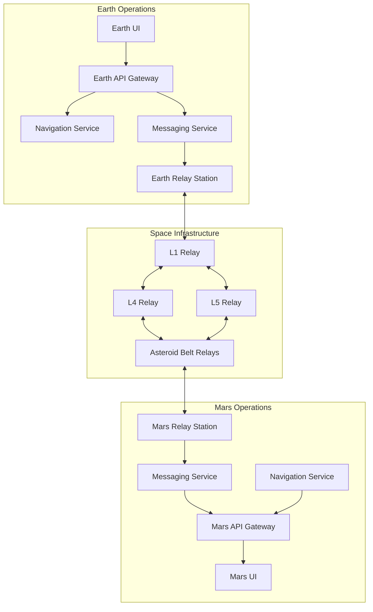
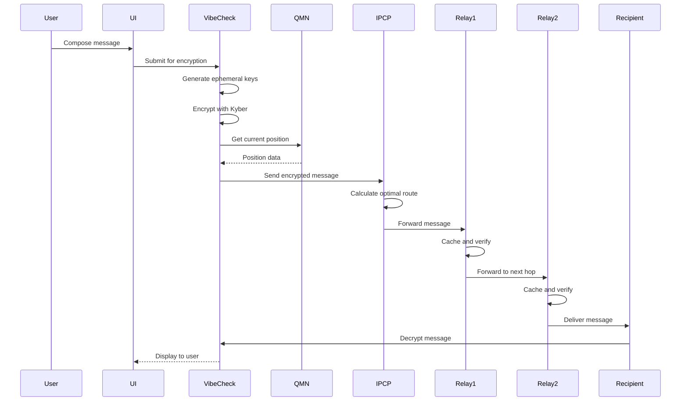
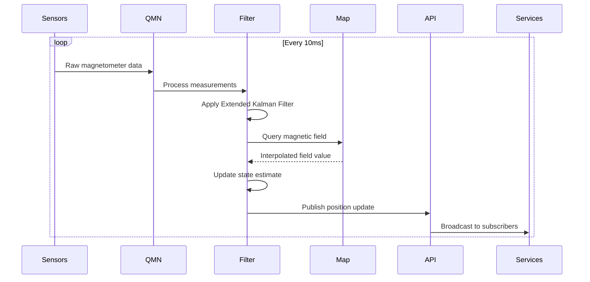
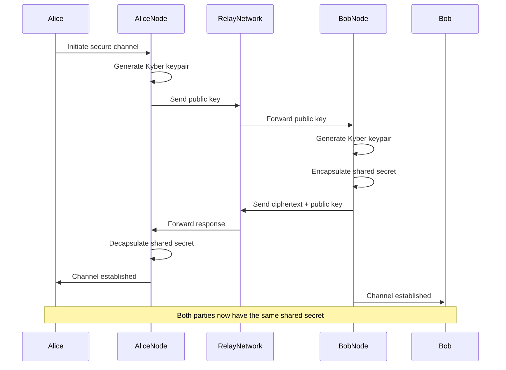
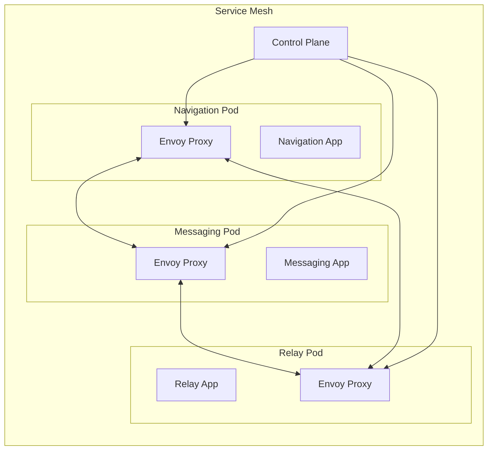
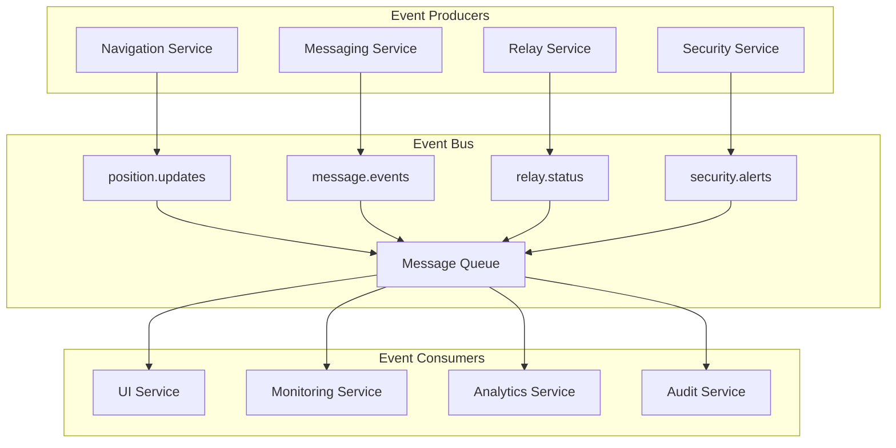
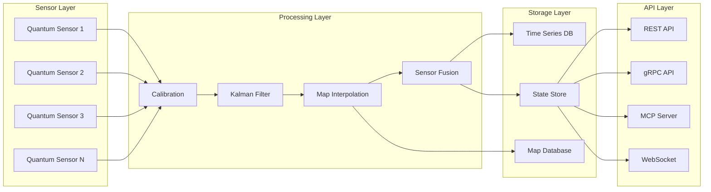
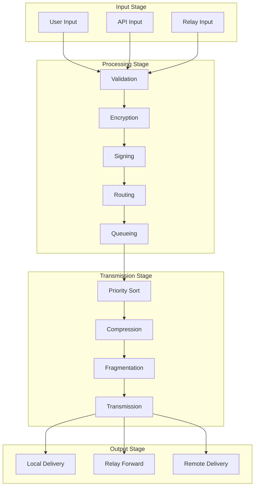
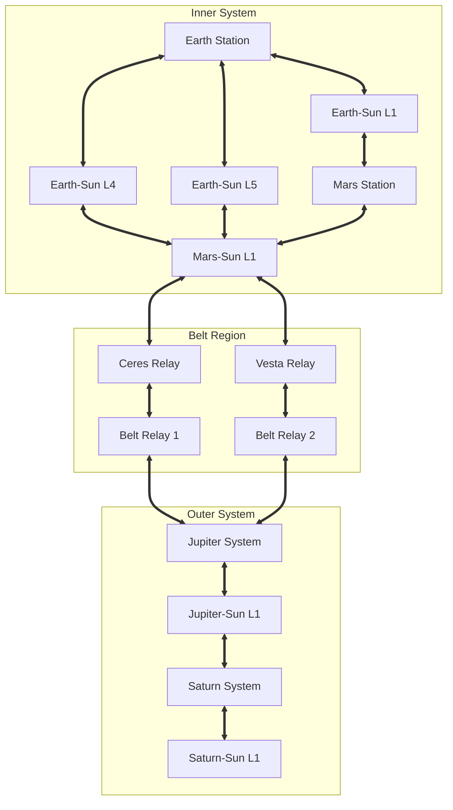

# Vibecast Integration Diagrams

## System Integration Overview



## Message Flow Integration

### End-to-End Message Delivery



### Navigation Update Flow



### Security Handshake Flow



## Component Integration Patterns

### Service Mesh Integration



### Event-Driven Architecture



## Data Flow Specifications

### Navigation Data Pipeline



### Message Processing Pipeline



### Relay Network Topology



## Integration Interfaces

### REST API Integration

```yaml
openapi: 3.0.0
info:
  title: Vibecast API
  version: 1.0.0
  
paths:
  /api/v1/navigation/position:
    get:
      summary: Get current position
      responses:
        200:
          content:
            application/json:
              schema:
                type: object
                properties:
                  latitude: {type: number}
                  longitude: {type: number}
                  altitude: {type: number}
                  accuracy: {type: number}
                  timestamp: {type: string}
                  
  /api/v1/messages:
    post:
      summary: Send a message
      requestBody:
        content:
          application/json:
            schema:
              type: object
              properties:
                recipient: {type: string}
                content: {type: string}
                priority: {type: string}
                ttl: {type: integer}
      responses:
        202:
          content:
            application/json:
              schema:
                type: object
                properties:
                  messageId: {type: string}
                  status: {type: string}
                  estimatedDelivery: {type: string}
```

### gRPC Service Definitions

```protobuf
syntax = "proto3";

package vibecast.navigation.v1;

service NavigationService {
  rpc GetPosition(GetPositionRequest) returns (Position);
  rpc StreamPositions(StreamRequest) returns (stream Position);
  rpc CalibratesSensors(CalibrationRequest) returns (CalibrationResult);
  rpc UpdateMap(MapUpdate) returns (UpdateResult);
}

message Position {
  double latitude = 1;
  double longitude = 2;
  double altitude = 3;
  double accuracy = 4;
  int64 timestamp = 5;
  repeated SensorReading sensors = 6;
}

service MessagingService {
  rpc SendMessage(Message) returns (SendResult);
  rpc ReceiveMessages(ReceiveRequest) returns (stream Message);
  rpc GetMessageStatus(MessageId) returns (MessageStatus);
}

message Message {
  string id = 1;
  string sender = 2;
  string recipient = 3;
  bytes encrypted_content = 4;
  bytes signature = 5;
  int64 timestamp = 6;
  Priority priority = 7;
}
```

### WebSocket Events

```typescript
// WebSocket Event Types
interface WebSocketEvents {
  // Navigation Events
  'navigation:position': {
    latitude: number
    longitude: number
    altitude: number
    accuracy: number
    timestamp: number
  }
  
  'navigation:sensor': {
    sensorId: string
    type: 'magnetometer' | 'accelerometer' | 'gyroscope'
    values: number[]
    timestamp: number
  }
  
  // Messaging Events
  'message:received': {
    id: string
    sender: string
    preview: string
    timestamp: number
  }
  
  'message:sent': {
    id: string
    recipient: string
    status: 'queued' | 'transmitting' | 'delivered'
    timestamp: number
  }
  
  'message:status': {
    id: string
    status: 'delivered' | 'failed' | 'expired'
    details: string
  }
  
  // Relay Events
  'relay:status': {
    relayId: string
    status: 'online' | 'offline' | 'degraded'
    metrics: RelayMetrics
  }
  
  'relay:topology': {
    changes: TopologyChange[]
    timestamp: number
  }
  
  // System Events
  'system:alert': {
    level: 'info' | 'warning' | 'error' | 'critical'
    component: string
    message: string
    timestamp: number
  }
}

// WebSocket Client
class VibecastWebSocket {
  constructor(url: string) {
    this.ws = new WebSocket(url)
    this.setupHandlers()
  }
  
  on<E extends keyof WebSocketEvents>(
    event: E,
    handler: (data: WebSocketEvents[E]) => void
  ): void
  
  emit<E extends keyof WebSocketEvents>(
    event: E,
    data: WebSocketEvents[E]
  ): void
  
  subscribe(topics: string[]): void
  unsubscribe(topics: string[]): void
}
```

## Integration Testing Scenarios

### Scenario 1: End-to-End Message Delivery

```yaml
test: end_to_end_message_delivery
steps:
  - name: Setup
    actions:
      - Start all services
      - Initialize relay network
      - Create test users
      
  - name: Send Message
    actions:
      - Compose message in UI
      - Verify encryption
      - Check routing selection
      
  - name: Transit
    actions:
      - Monitor relay hops
      - Verify caching
      - Check link quality
      
  - name: Delivery
    actions:
      - Confirm receipt
      - Verify decryption
      - Check integrity
      
expected:
  - Message delivered within SLA
  - All security checks pass
  - No data corruption
```

### Scenario 2: Navigation Accuracy Test

```yaml
test: navigation_accuracy_verification
steps:
  - name: Sensor Simulation
    actions:
      - Generate known trajectory
      - Simulate sensor readings
      - Add realistic noise
      
  - name: Position Estimation
    actions:
      - Process through Kalman filter
      - Compare with ground truth
      - Calculate error metrics
      
  - name: Map Update
    actions:
      - Collect measurements
      - Update magnetic map
      - Verify improvements
      
expected:
  - Position error < 10 meters
  - Convergence within 10 seconds
  - Map accuracy improvement
```

### Scenario 3: Relay Network Resilience

```yaml
test: relay_network_failure_recovery
steps:
  - name: Normal Operation
    actions:
      - Send messages through network
      - Monitor performance metrics
      - Establish baseline
      
  - name: Inject Failures
    actions:
      - Disable primary relay
      - Simulate solar storm
      - Overload relay capacity
      
  - name: Recovery
    actions:
      - Verify automatic rerouting
      - Check message delivery
      - Monitor performance degradation
      
expected:
  - No message loss
  - Automatic route recovery
  - Graceful degradation
```

## Performance Optimization

### Caching Strategy

```yaml
cache_layers:
  browser:
    - Static assets (1 year)
    - API responses (5 minutes)
    - WebSocket reconnection tokens
    
  api_gateway:
    - User sessions (1 hour)
    - Permission checks (10 minutes)
    - Rate limit counters (1 minute)
    
  service_level:
    - Navigation positions (1 second)
    - Relay topology (5 minutes)
    - Message queue (until delivered)
    - Magnetic maps (24 hours)
    
  relay_station:
    - Message cache (1 week)
    - Routing tables (1 hour)
    - Link metrics (5 minutes)
```

### Load Balancing Configuration

```nginx
upstream navigation_backend {
    least_conn;
    server nav1.vibecast.space:8080 weight=3;
    server nav2.vibecast.space:8080 weight=3;
    server nav3.vibecast.space:8080 weight=2;
    keepalive 32;
}

upstream messaging_backend {
    ip_hash;
    server msg1.vibecast.space:8081;
    server msg2.vibecast.space:8081;
    server msg3.vibecast.space:8081;
    keepalive 64;
}

location /api/v1/navigation {
    proxy_pass http://navigation_backend;
    proxy_http_version 1.1;
    proxy_set_header Connection "";
}

location /api/v1/messages {
    proxy_pass http://messaging_backend;
    proxy_http_version 1.1;
    proxy_set_header Upgrade $http_upgrade;
    proxy_set_header Connection "upgrade";
}
```

## Monitoring and Observability

### Metrics Collection

```yaml
metrics:
  navigation:
    - position_accuracy_meters
    - sensor_update_rate_hz
    - map_query_latency_ms
    - kalman_filter_convergence_time_s
    
  messaging:
    - messages_sent_per_minute
    - encryption_time_ms
    - queue_depth
    - delivery_success_rate
    
  relay:
    - bandwidth_utilization_percent
    - message_cache_hit_rate
    - link_quality_score
    - routing_calculation_time_ms
    
  system:
    - cpu_usage_percent
    - memory_usage_gb
    - disk_io_mbps
    - network_throughput_mbps
```

### Distributed Tracing

```yaml
tracing:
  instrumentation:
    - OpenTelemetry SDK
    - Automatic span creation
    - Context propagation
    - Sampling rate: 0.1%
    
  trace_points:
    - API request entry
    - Service boundaries
    - Database queries
    - External API calls
    - Message queue operations
    
  storage:
    backend: Jaeger
    retention: 7 days
    sampling: Adaptive
```

### Alerting Rules

```yaml
alerts:
  critical:
    - name: NavigationServiceDown
      condition: up{job="navigation"} == 0
      duration: 1m
      
    - name: MessageDeliveryFailure
      condition: rate(message_delivery_failed[5m]) > 0.1
      duration: 5m
      
    - name: RelayOffline
      condition: relay_status{status="offline"} == 1
      duration: 2m
      
  warning:
    - name: HighLatency
      condition: api_latency_p99 > 1000
      duration: 10m
      
    - name: LowCacheHitRate
      condition: cache_hit_rate < 0.5
      duration: 15m
      
    - name: DiskSpaceLow
      condition: disk_free_percent < 20
      duration: 5m
```

---

This comprehensive integration documentation provides detailed diagrams and specifications for how all Vibecast components work together to deliver reliable interplanetary communication capabilities.