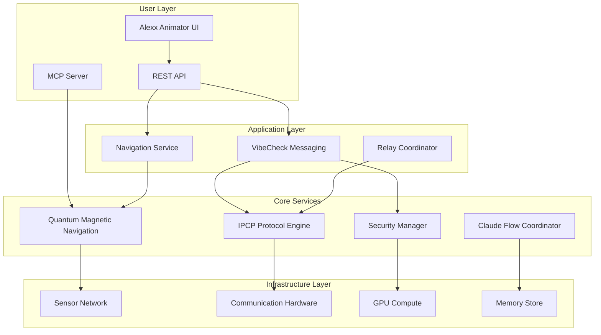

# Vibecast Interplanetary Communication System Architecture

## Executive Summary

The Vibecast Interplanetary Communication System represents a revolutionary approach to deep space communication, integrating quantum magnetic navigation, secure messaging protocols, and distributed relay networks. This architecture enables reliable, secure communication across the solar system while providing precise navigation capabilities for spacecraft and settlements.

## Table of Contents

1. [System Overview](#system-overview)
2. [Core Components](#core-components)
3. [Architecture Layers](#architecture-layers)
4. [Component Integration](#component-integration)
5. [Data Flow Architecture](#data-flow-architecture)
6. [Security Architecture](#security-architecture)
7. [Scalability Design](#scalability-design)
8. [User Interface Architecture](#user-interface-architecture)
9. [Deployment Architecture](#deployment-architecture)
10. [Future Considerations](#future-considerations)

## System Overview

### Mission Statement
Enable secure, reliable, and efficient communication between Earth and human settlements across the solar system using quantum technologies and distributed relay networks.

### Key Capabilities
- **Quantum Navigation**: Precise position determination using magnetic field mapping
- **Secure Messaging**: Quantum-resistant encryption for VibeCheck communications
- **Relay Networks**: Self-organizing mesh of communication satellites
- **Real-time Visualization**: GPU-accelerated interface for system monitoring
- **Adaptive Routing**: Dynamic path selection based on planetary positions

### System Architecture Diagram



## Core Components

### 1. Quantum Magnetic Navigation (QMN)
**Purpose**: Provide precise position and orientation data using quantum sensors

**Key Modules**:
- `sensor/`: Magnetometer interfaces and calibration
- `mapping/`: Magnetic field interpolation and storage
- `filter/`: Extended Kalman Filter for state estimation
- `mcp/`: Model Context Protocol server for tool integration

**Interfaces**:
```python
class NavigationService:
    def get_position() -> GeoPosition
    def get_orientation() -> Quaternion
    def calibrate_sensors() -> CalibrationResult
    def update_map(region: Region, data: MagneticData) -> MapUpdate
```

### 2. Interplanetary Communication Protocol (IPCP)
**Purpose**: Manage reliable message transmission across vast distances

**Key Features**:
- Adaptive routing based on planetary positions
- Multi-path redundancy for critical messages
- Store-and-forward capability for network disruptions
- Bandwidth optimization using predictive compression

**Protocol Stack**:
```
Application Layer:    VibeCheck Messages
Transport Layer:      IPCP-Transport (reliability, ordering)
Network Layer:        IPCP-Routing (path selection)
Link Layer:          IPCP-Link (error correction)
Physical Layer:       Quantum/Radio transceivers
```

### 3. VibeCheck Secure Messaging
**Purpose**: Enable private, authenticated communication between users

**Security Features**:
- Quantum-resistant encryption (CRYSTALS-Kyber)
- Perfect forward secrecy
- Distributed key management
- Message integrity verification

**Message Flow**:
1. User composes message in UI
2. Message encrypted with recipient's public key
3. Signed with sender's private key
4. Wrapped in IPCP envelope
5. Transmitted through relay network
6. Verified and decrypted at destination

### 4. Relay Station Network
**Purpose**: Extend communication range and provide redundancy

**Network Topology**:
```
Earth <--> L1 Relay <--> Mars Orbit Relay <--> Mars Surface
       |                        |
       +-> L4/L5 Relays <-------+
       |
       +-> Asteroid Belt Relays --> Outer Planets
```

**Relay Capabilities**:
- Autonomous station-keeping using QMN
- Message caching and prioritization
- Dynamic bandwidth allocation
- Solar storm resilience

### 5. Alexx Animator UI
**Purpose**: Provide intuitive visualization and control interface

**Key Features**:
- Real-time 3D solar system visualization
- Message status tracking
- Navigation data display
- System health monitoring
- GPU-accelerated rendering

## Architecture Layers

### Presentation Layer
- **Alexx Animator**: React-based UI with WebGL rendering
- **REST API**: Express.js server for client communication
- **MCP Interface**: Tool-based integration for AI assistants

### Application Layer
- **VibeCheck Service**: Message composition, encryption, routing
- **Navigation Service**: Position calculation, sensor fusion
- **Relay Coordinator**: Network topology management

### Domain Layer
- **Message Model**: Encrypted payload, metadata, routing info
- **Navigation Model**: Position, velocity, orientation states
- **Network Model**: Relay status, link quality, routing tables

### Infrastructure Layer
- **Sensor Drivers**: Hardware abstraction for quantum sensors
- **Communication Drivers**: Radio/laser transceiver control
- **GPU Compute**: CUDA/WebGPU for parallel processing
- **Persistent Storage**: Time-series DB for sensor data

## Component Integration

### Integration Architecture
```yaml
services:
  navigation:
    depends_on: [sensors, gpu_compute]
    provides: [position_api, mcp_tools]
    
  messaging:
    depends_on: [navigation, security, relay_network]
    provides: [vibecheck_api, message_queue]
    
  ui:
    depends_on: [messaging, navigation]
    provides: [web_interface, visualization]
    
  coordinator:
    depends_on: [all_services]
    provides: [orchestration, memory_management]
```

### Service Communication
- **Internal**: gRPC for low-latency service calls
- **External**: REST/WebSocket for client communication
- **Hardware**: Custom protocols for sensor/transceiver control
- **AI Tools**: MCP for Claude Flow integration

### Data Synchronization
```python
class SyncManager:
    def sync_navigation_state(local: State, remote: State) -> State
    def sync_message_queue(queue: MessageQueue) -> SyncResult
    def sync_relay_topology(network: NetworkGraph) -> TopologyUpdate
    def sync_security_keys(keystore: KeyStore) -> KeyUpdate
```

## Data Flow Architecture

### Navigation Data Flow
```
Quantum Sensors --> Raw Data --> Kalman Filter --> Position/Orientation
                        |
                        v
                  Magnetic Map --> Interpolation --> Refined Position
                        |
                        v
                  Map Updates --> Distributed to Relays
```

### Message Data Flow
```
User Input --> Encryption --> IPCP Wrapping --> Relay Selection
                                                       |
                                                       v
                                              Transmission Queue
                                                       |
                                                       v
                                         Multi-path Transmission
                                                       |
                                                       v
                                           Destination Relay
                                                       |
                                                       v
                                    Decryption --> User Delivery
```

### Telemetry Data Flow
```
All Components --> Metrics Collection --> Time-series Storage
                           |
                           v
                    Analytics Engine --> Dashboard Updates
                           |
                           v
                    Anomaly Detection --> Alert System
```

## Security Architecture

### Threat Model
1. **Interception**: Messages captured in transit
2. **Impersonation**: Fake relay stations or users
3. **Denial of Service**: Overwhelming relay capacity
4. **Quantum Attacks**: Future quantum computers breaking encryption
5. **Physical Compromise**: Relay station capture

### Security Layers

#### 1. Quantum-Resistant Cryptography
```python
class SecurityManager:
    # Key Exchange
    kyber = CRYSTALS_Kyber_1024()
    
    # Digital Signatures  
    dilithium = CRYSTALS_Dilithium_5()
    
    # Symmetric Encryption
    aes_gcm = AES_256_GCM()
    
    # Hash Functions
    sha3 = SHA3_512()
```

#### 2. Multi-Factor Authentication
- Something you know: Password/passphrase
- Something you have: Hardware security key
- Something you are: Biometric data
- Somewhere you are: Navigation position verification

#### 3. Message Security Protocol
```
1. Generate ephemeral key pair
2. Exchange keys using Kyber
3. Encrypt message with AES-GCM
4. Sign with Dilithium
5. Add timestamp and nonce
6. Wrap in secure envelope
```

#### 4. Network Security
- Relay authentication using certificates
- Link encryption between all nodes
- Traffic analysis resistance
- Intrusion detection system

## Scalability Design

### Horizontal Scaling
```yaml
relay_network:
  scaling_strategy: "autonomous_mesh"
  node_capacity: "10 Gbps"
  redundancy_factor: 3
  max_hops: 5
  
message_queue:
  sharding: "by_destination"
  replicas: 3
  consistency: "eventual"
  
navigation_service:
  instances: "per_region"
  load_balancing: "geographic"
```

### Performance Optimization
1. **GPU Acceleration**
   - Sensor data processing
   - Cryptographic operations
   - Message compression
   - Route optimization

2. **Caching Strategy**
   - Navigation data: 1-minute TTL
   - Relay topology: 1-hour TTL
   - User keys: 24-hour TTL
   - Message queue: Until delivered

3. **Data Partitioning**
   - Sensor data by timestamp
   - Messages by destination
   - Maps by geographic region
   - Logs by service

### Capacity Planning
```
Earth-Mars Communication:
- Round-trip time: 6-44 minutes
- Bandwidth: 10 Mbps per relay
- Message size: 1-10 KB average
- Capacity: 1M messages/day/relay

Navigation Updates:
- Sensor rate: 100 Hz
- Position updates: 10 Hz
- Map updates: Daily
- Storage: 1 TB/year/region
```

## User Interface Architecture

### Component Structure
```typescript
// Main Application Container
interface VibecastApp {
  navigation: NavigationView
  messaging: MessagingView
  visualization: SolarSystemView
  monitoring: SystemHealthView
}

// Navigation Display
interface NavigationView {
  position: PositionDisplay
  velocity: VelocityVector
  orientation: OrientationCube
  sensorStatus: SensorGrid
}

// Messaging Interface
interface MessagingView {
  composer: MessageComposer
  inbox: MessageList
  contacts: ContactManager
  encryption: SecurityStatus
}
```

### Visualization Pipeline
```
Telemetry Data --> WebSocket --> State Store --> React Components
                                      |
                                      v
                              Three.js Scene --> WebGL Rendering
                                      |
                                      v
                              GPU Shaders --> Visual Effects
```

### Responsive Design
- Desktop: Full 3D visualization + all panels
- Tablet: Simplified 3D + essential controls
- Mobile: 2D map view + messaging only
- AR/VR: Immersive 3D environment

## Deployment Architecture

### Containerized Services
```dockerfile
# Navigation Service
FROM ubuntu:22.04
RUN apt-get update && apt-get install -y \
    python3-pip \
    cuda-toolkit-12 \
    libhdf5-dev
COPY qmag_nav/ /app/
CMD ["python", "-m", "qmag_nav.service.api"]

# Messaging Service  
FROM node:20-alpine
WORKDIR /app
COPY vibecheck/ .
RUN npm install --production
CMD ["node", "server.js"]

# UI Service
FROM node:20-alpine AS builder
WORKDIR /app
COPY alexx-animator/ .
RUN npm install && npm run build

FROM nginx:alpine
COPY --from=builder /app/dist /usr/share/nginx/html
```

### Kubernetes Orchestration
```yaml
apiVersion: apps/v1
kind: Deployment
metadata:
  name: vibecast-navigation
spec:
  replicas: 3
  selector:
    matchLabels:
      app: navigation
  template:
    spec:
      containers:
      - name: navigation
        image: vibecast/navigation:latest
        resources:
          requests:
            memory: "4Gi"
            cpu: "2"
            nvidia.com/gpu: 1
---
apiVersion: v1
kind: Service
metadata:
  name: navigation-service
spec:
  selector:
    app: navigation
  ports:
  - port: 8080
    targetPort: 8080
  type: LoadBalancer
```

### Infrastructure Requirements

#### Earth Base Station
- High-gain antenna array (70m dishes)
- Quantum sensor array for navigation
- GPU cluster for processing
- Redundant power and cooling
- 10 Gbps internet connectivity

#### Relay Stations
- Solar panels (100 kW)
- Ion thrusters for station-keeping
- Laser/radio transceivers
- Radiation-hardened computers
- Cryogenic cooling for sensors

#### Mars Operations Center
- Similar to Earth but smaller scale
- Integration with habitat systems
- Dust storm resilience
- Local message caching

## Future Considerations

### Phase 2: Outer Planets
- Jupiter system relay network
- Enhanced radiation shielding
- Longer message delays (up to 90 minutes)
- Autonomous decision making

### Phase 3: Interstellar Preparation
- Laser communication upgrades
- Breakthrough Starshot integration
- Decades-long message storage
- Generation ship compatibility

### Technology Upgrades
1. **Quantum Entanglement Communication**
   - Instant communication research
   - Entangled particle distribution
   - Decoherence mitigation

2. **AI Enhancement**
   - Predictive message routing
   - Automated anomaly response
   - Natural language processing

3. **Biological Integration**
   - Neural interface compatibility
   - Biometric security expansion
   - Health monitoring integration

### Standards Development
- IETF RFC for IPCP protocol
- ISO standards for quantum navigation
- IEEE standards for relay networks
- W3C standards for space web

## Conclusion

The Vibecast Interplanetary Communication System architecture provides a robust, scalable, and secure foundation for humanity's expansion into the solar system. By integrating quantum navigation, secure messaging, and distributed relay networks, we enable reliable communication across vast distances while maintaining the security and privacy users expect.

The modular design allows for incremental deployment and continuous improvement as technology advances and our presence in space expands. From the first Mars colony to eventual interstellar missions, Vibecast will connect humanity across the cosmos.

---

*Architecture Version: 1.0.0*  
*Last Updated: July 2025*  
*Next Review: January 2026*